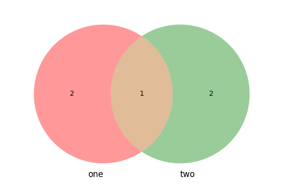

Python Data Structures: Sets
============================

Python sets are:

    - Unordered, non indexable, distinct immutable (hashable) elements.
    - Come in two flavours :class:`set` (mutable) & :class:`frozenset` (immutable).
    - Sets cannot contain other sets as they are not hashable, they can contain :class:`frozenset` instances.
    - Sets offer quick membership testing `in` and removing duplicates from other collections.
    - Sets support a whole host of mathematical operations (set theory) such as `union` & `intersection` etc.

-----

Sets: Instantiation
--------------------

Python sets can be created in a number of different ways:

    .. code-block:: python

        # simple set() constructor:
        empty_set = set()
        # set from any iterable:
        set_from_iter = set(range(1, 10))
        # set using the braces syntax:
        set_braces = {"one", "two", "three"}
        # set using a set comprehension:
        set_comp = {n for n in range(20) if n % 2 == 0}

Care is advised when using the curly braces, often when trying to create an empty set, subtle bugs
can be introduced as python treats `{}` as a :class:`dict`.

    .. code-block:: python

        type({}) # dict

Sets themselves are not immutable and thus, not hashable so this means that sets cannot store sets within
themselves, another build in data structure is the :class:`frozenset` which can be used as elements inside
sets themselves:

    .. code-block:: python

        s = {{1,2}, {3,4}}
        # TypeError: un-hashable type: `set`
        frozen = frozenset({1,2})
        >>> frozenset({1,2})

More can be found about frozenset later in the documentation.

We touched briefly on sets being unable to add non hashable elements, in python both
:class:`list` and :class:`dict` are also `mutable` and thus, neither can be added
to a normal :class:`set`:

    .. code-block:: python

        s = {[1,2,3]}
        # TypeError: un-hashable type: `list`
        s = {dict(a=1)}
        # TypeError: un-hashable type: `dict`

However, because the `set()` class permits building a set from an iterable and both
list and dictionary are iterable (dict over keys by default), then populating a set
from both of the collections is possible:

    .. code-block:: python

        s = set([1,2,3,4,5])
        # {1, 2, 3, 4, 5}
        s = set(dict(a=1, b=2, c=3))
        # {'a', 'b', 'c'}

Sets: Distinction
------------------

We mentioned previously that sets must contain hashable elements only, this is because similarly to
dictionary keys, sets use the hash value of the object it is attempting to store internally.  This
is why `in` checks are extremely fast in sets, they are backed by a hash table. In order to be able
to store your custom objects in a `set` (or alternatively use them for dictionary `keys`) you can
implement two magic methods, `__hash__` and `__eq__` respectively.

By default, user defined objects have the following in python:

    * an implementation of `__hash__`.
    * an implementation of `__eq__` which results in no two instances being equal.

    .. code-block:: python

        class Example:
            def __init__(self, x: int) -> None:
                self.x = x

        e = Example(100)
        e2 = Example(100)
        hash(e)  # 108032011057
        hash(e2)  # 108032014237 (different)
        e == e2  # False
        {e, e2}  # {<__main__.Example at 0x192735ab310>, <__main__.Example at 0x192735b79d0>}

By default this permits us to store instances of `Example` in a set by default as highlighted above.
In order to use our own user defined objects in sets effectively, we should implement both the
dunder `__hash__` and `__eq__` methods to consider two instances of :class:`Example` equal.

    .. code-block:: python

        from __future__ import annotations # __eq__ `other` type hint of the class itself

        class ImprovedExample:
            def __init__(self, x: int) -> None:
                self.x = x

            def __hash__(self) -> int:
                return hash(self.x)

            def __eq__(self, other: ImprovedExample) -> bool:
                # note: returning `NotImplemented` here tells python to try the reflected operation on `other`.
                if not isinstance(other, type(self)): return NotImplemented
                return self.x == other.x

Now we are able to store instances of `ImprovedExample` in both sets and in dictionaries as keys:

    .. code-block:: python

        one, two, three = ImprovedExample(100), ImprovedExample(200), ImprovedExample(100)
        {one, two, three}  # one == three & hash(one) == hash(three) thus only 2 are stored (distinct)
        """
        {<__main__.ImprovedExample at 0x1927465c490>,
        <__main__.ImprovedExample at 0x1927465c880>}
        """

** If a class does not implement dunder __eq__, it should never implement dunder __hash__. **

Sets: Method resolution order
------------------------------
Pythons :class:`collections.abc.Set` MRO is described below:

    .. code-block:: python

        from collections.abc import Set

        Set.mro()
        """
        (collections.abc.Set,
         collections.abc.Collection,
         collections.abc.Sized,
         collections.abc.Iterable,
         collections.abc.Container,
         object)

        Set inherits from `Collection`
        `Collection` inherits from `Sized` which provides len(set).
        `Collection` inherits from `Iterable` which allows sets to be iterated over.
        `Collection inherits from `Container` which allows sets to perform `in` checks via `__contains__`.
        and lastly, everything inherits from `object`.

        `Set` inherits a lot of additional capabilities through its mixin methods:
            * __le__
            * __lt__
            * __eq__
            * __new__
            * __gt__
            * __ge__
            * __and__
            * __or__
            * __sub__
            * __xor__
            * isdisjoint()

        A lot of these mixin methods will be discussed later in depth and how objects
        can slot right into pythons data model and be considered pythonic.
        """

Sets: Operations I - Basics
----------------------------

Many operations supported on other data structures do not make logical sense for sets,
however sets themselves offer a very robust set of operations to align them nicely
with sets in mathematics.  Some functionality not supported by sets are (that of sequences)
like slicing a set, or finding the `index` of a given `element` within the set.

    .. code-block:: python

        s = {1,2,3,4,5,6}
        s[1:3]
        # TypeError: set object is not subscriptable

        s = {5,4,3,2,1}
        s.index(4)
        # AttributeError: set object has no attribute: index

In order to fully understand the power of sets, we need to understand the distinct
differences between three things:

    * object methods
    * object operations
    * augmented operations  (we will touch on this later on).

Almost all the functionality of python sets can be performed in two main ways.  Via
set instance methods, for example:

    .. code-block:: python

        s = {1,2,3}
        s.union({3,4,5})  # Method invocation -> {1,2,3,4,5}

Alternatively, as we touched on earlier, through various mixin methods implemented on
:class:`Set`, the following is also supported:

    .. code-block:: python

        one = {1,2,3}
        two = {3,4,5}
        one | two  # Operation invocation -> {1,2,3,4,5}

Notice how the duplicate `3` entry in both cases is deduped, a simple trait of sets (to remove
duplicates).  Both examples above result in (almost) the same thing happening, functionally it
is the same, however operations tend to be slightly faster, this is outlined below:

    .. code-block:: python

        import dis
        one = {1,2,3}
        two = {3,4,5}
        dis.dis("one.update(two)")
        """
        1     0 LOAD_NAME                0 (one)
              2 LOAD_METHOD              1 (update)
              4 LOAD_NAME                2 (two)
              6 CALL_METHOD              1
              8 RETURN_VALUE
        """

        dis.dis("one | two")
        """
          1   0 LOAD_NAME                0 (one)
              2 LOAD_NAME                1 (two)
              4 BINARY_OR
              6 RETURN_VALUE
        """

In the above example we can see two additional `bytecode instructions`: `LOAD_METHOD` and `CALL_METHOD`.
For a real world bench mark, lets perform the same task (getting the union of the above two sets) to
see the difference (20 million times).

    .. code-block:: python

        import timeit
        timeit.timeit("one.union(two)", setup="one={1,2,3}; two={3,4,5}", number=20_000_000)
        # 4.246593700000005 (4.2 seconds)
        timeit.timeit("one | two", setup="one={1,2,3}; two={3,4,5}", number=20_000_000)
        # 3.168324699999971 (3.1 seconds)

While negligible it is important to understand that operator approaches are often faster.  There are however
a few subtle differences / caveats to be aware of.

    * when using the method based approach, e.g `union()` any `iterable` can be provided and python will handle it
    * when using the operator based approach, e.g `|` all objects must be of type: `set`.

    .. code-block:: python

        s = {1,2,3}
        s.union([2,4,6,8])
        # {1, 2, 3, 4, 6, 8}
        s | [2,4,6,8]
        # unsupported operand type(s) for |: `set` and `list`.

By default, both the methods and basic operators return a new `set` instance.  We briefly spoke about
`augmented operators`, these can be used to modify set `s` in-place, more on that later.

Sets: Operations II - Intermediate
-----------------------------------

We touched briefly on the `union()` method of sets, now we will outline all the available functionality
including appropriate `venn` diagrams for various operations.

    .. code-block:: python

        methods = tuple(attr for attr in dir(set()) if "__" not in attr)
        """
        ('add',
         'clear',
         'copy',
         'difference',
         'difference_update',
         'discard',
         'intersection',
         'intersection_update',
         'isdisjoint',
         'issubset',
         'issuperset',
         'pop',
         'remove',
         'symmetric_difference',
         'symmetric_difference_update',
         'union',
         'update')
        """

Method: ``add(elem)``:
    * **Description**: adds a single element (``elem``) into the set, if ``elem`` is already a member, this does nothing.
    * **Operator equivalent**: **Not Applicable**

    .. code-block:: python

        s = set()
        s.add(100)
        # {100}

Method: ``clear()``:
    * **Description**: Removes all elements from the set
    * **Operator equivalent**: **Not Applicable**

    .. code-block:: python

        s = set(range(10))
        # {1,2,3,4,5,6,7,8,9}
        s.clear()
        # set()

Method: ``copy()``:
    * **Description**: Creates a ``shallow`` copy of the set
    * **Operator equivalent**: **Not Applicable**

    .. code-block:: python

        s = {1,2,3}
        s2 = s.copy()
        s == s2  # True
        s is s2  # False
        s.add(4)
        # s {1,2,3,4}
        # s2 {1,2,3}

Method: ``difference(*other_sets)``:
    * **Description**: Return a ``new`` set of the difference of this set and ``*other_sets``.
    * **Operator Equivalent**: ``-``
    * **Notes**: Difference is calculated left ``<-`` to right ``->`` when multiple ``*other_sets`` are provided.
    * **Notes**: Difference is basically, items in ``x`` but not in ``y`` or ``z`` -> x.difference(y,z) : x | y | z
    * **Notes**: As always, operator invocations must be of type: ``Set``, ``difference()`` will work with iterables.

    .. code-block:: python

        x = {1,2,3}
        y = {3,4,5}
        x.difference(y)
        # {1,2}

When we compute the difference between one or multiple sets, we are working from left to right
and basically subtracting any elements from the next to be checked set from the set that we
previously built, here is a documented example using 3 sets:

    .. code-block:: python

        one = {1,2,3}
        two = {3,4,5}
        three = {2,3}

        # Generate three sets, two contains 1 number also in one, three contains two numbers in one

        # Check one against two using method and operator, both are equivalent except for speed.
        one.difference(two)
        # {1,2}
        one - two
        # {1,2}

        # Why? because `3` is in one and two, so we discard it, left to right is important here:

        two.difference(one)
        # {4,5}
        two - one
        # {4,5}

        # Now when we also check the difference when `three` gets involved:
        one.difference(two, three)
        # {1}
        one - two - three
        # {1}

Python implements this behaviour at the operator level by implementing ``__sub__``:

    .. code-block:: python

        def __sub__(self, other):
            if not isinstance(other, Set):
                if not isinstance(other, Iterable):
                    return NotImplemented
                other = self._from_iterable(other)
            return self._from_iterable(value for value in self if value not in other)
        # from_iterable is just a class method to build a set instance from any iterable.

As we touched on previously, remember when using operator syntax, sets **must** be passed:

    .. code-block:: python

        s = {1,3,5}
        s.difference([3], [5])
        # {1}
        s - [3] - [5]
        # TypeError: unsupported operand type(s) for -: 'set' and 'list'

Lastly, we can observe when multiple sets are compared for difference, python operates
from left ``<-`` to right ``->`` performing a ``BINARY_SUBTRACT`` bytecode instruction at each step:

    .. code-block:: python

        import dis
        x = {1,2,3}
        y = {3,4}
        z = {2}
        dis.dis("x - y")
        """
          1   0 LOAD_NAME                0 (x)
              2 LOAD_NAME                1 (y)
              4 BINARY_SUBTRACT
              6 RETURN_VALUE
        """

        dis.dis("x - y - z")
        """
          1   0 LOAD_NAME                0 (x)
              2 LOAD_NAME                1 (y)
              4 BINARY_SUBTRACT
              6 LOAD_NAME                2 (z)
              8 BINARY_SUBTRACT
             10 RETURN_VALUE
        """

Sets: Operations III - Advanced
--------------------------------

...

Sets: Frozensets
-----------------

...

Sets: Miscellaneous
--------------------

...

Sets: Summary
--------------

    * :class:`frozenset` is immutable, :class:`set` is mutable.
    * :class:`set` contain unordered, non indexable distinct hashable immutable elements.
    * Using empty `set comprehension` syntax will actually generate a `dictionary`.
    * create :class:`set` using `set()`, `{1,2,3}` or `{n for n in range(10) if n % 2 == 0}`.
    * create :class:`frozenset` using the `frozenset()` callable.
    * user defined objects can be stored in sets by default, but are never considered equal.
    * to add user defined objects to sets, implement `__hash__` and `__eq__`.
    * :class:`Set` inherits from :class:`collections.abc.Collection` which in turns inherits from `Sized`, `Iterable`, `Container`.
    * :class:`Set` permits many of its functionality through both method calls and operators.
    * :class:`Set` operator usage tends to be slightly faster due to not having to load & call a method.